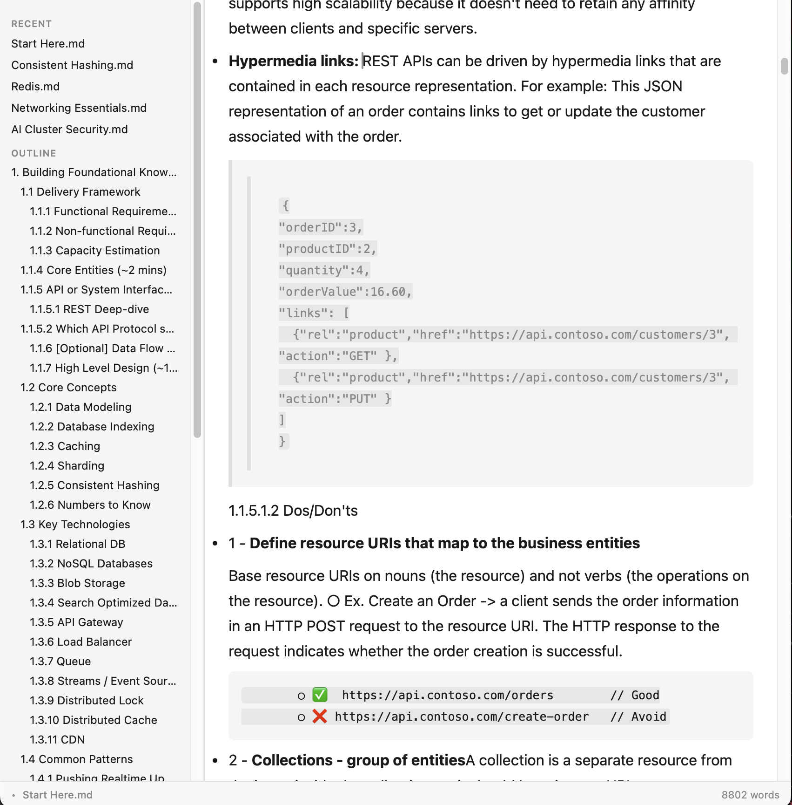
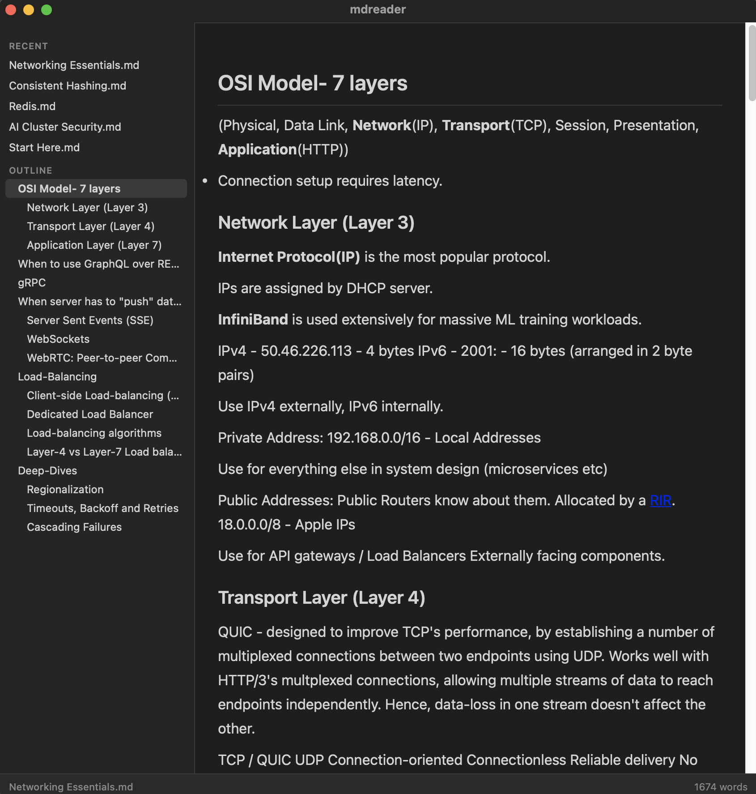

<div align="center">


# mdreader

**A native macOS markdown editor that renders as you type — no preview pane.**

[](https://www.apple.com/macos/)
[](https://tauri.app)
[](https://svelte.dev)
[](LICENSE)

</div>

---

## Screenshots

 ### Light theme



 ### Dark Theme

 

---

## What it is

mdreader is a minimal, distraction-free markdown editor for macOS. It uses TipTap (ProseMirror) for rich editing and CodeMirror for source mode — markdown syntax is parsed on the fly, so headings, bold, tables, and code blocks render immediately without a split-pane preview.

---

## Features

| | |
|---|---|
| **In-place rendering** | Markdown renders as you type — no preview pane required |
| **Source mode** | Toggle raw markdown with `Cmd+/`; edits sync back to rich mode |
| **Syntax highlighting** | Fenced code blocks highlighted via highlight.js |
| **Find & Replace** | `Cmd+F` to find, `Cmd+H` to replace |
| **Auto-save** | Opt-in via File › Auto Save; saves every 30 seconds |
| **Dark mode** | Follows system; cycle with `Cmd+Shift+T` — persists across restarts |
| **Distraction-free** | `Cmd+Shift+F` hides sidebar and status bar |
| **Quit protection** | Native dialog when closing with unsaved changes |
| **Font scaling** | `Cmd+=` / `Cmd+-` to resize editor text |
| **Word count** | Live count in the status bar |
| **Recent files** | Sidebar lists recently opened files |
| **External links** | Clicked links open in your default browser |

### Supported markdown

Headings · Bold · Italic · Strikethrough · Inline code · Blockquotes · Ordered & unordered lists · Task lists · Tables · Fenced code blocks

---

## Keyboard shortcuts

| Shortcut | Action |
|---|---|
| `Cmd+O` | Open file |
| `Cmd+S` | Save |
| `Cmd+Shift+S` | Save as |
| `Cmd+N` | New file |
| `Cmd+/` | Toggle source mode |
| `Cmd+Shift+F` | Toggle distraction-free mode |
| `Cmd+Shift+L` | Toggle sidebar |
| `Cmd+Shift+T` | Cycle theme (light → dark → system) |
| `Cmd+=` / `Cmd+-` | Increase / decrease font size |
| `Cmd+F` | Find |
| `Cmd+H` | Find and replace |

---

## Tech stack

| Layer | Technology |
|---|---|
| Native shell & file I/O | [Tauri 2](https://tauri.app) (Rust) |
| UI | [Svelte 5](https://svelte.dev) with runes reactivity |
| Rich editor | [TipTap 2](https://tiptap.dev) (ProseMirror) |
| Source editor | [CodeMirror 6](https://codemirror.net) |
| Markdown serialization | [tiptap-markdown](https://github.com/aguingand/tiptap-markdown) |
| Syntax highlighting | [highlight.js](https://highlightjs.org) |

---

## Development

```sh
npm install
npm run dev        # Vite dev server (browser only, no Tauri)
npm run tauri dev  # full Tauri app with native features
```

### Testing

```sh
npm run test:unit          # Vitest unit tests
npx playwright test        # e2e tests against Vite dev server
cd src-tauri && cargo test # Rust unit tests
```

### Building

```sh
npm run tauri build        # produces a .dmg in src-tauri/target/release/bundle/
```
